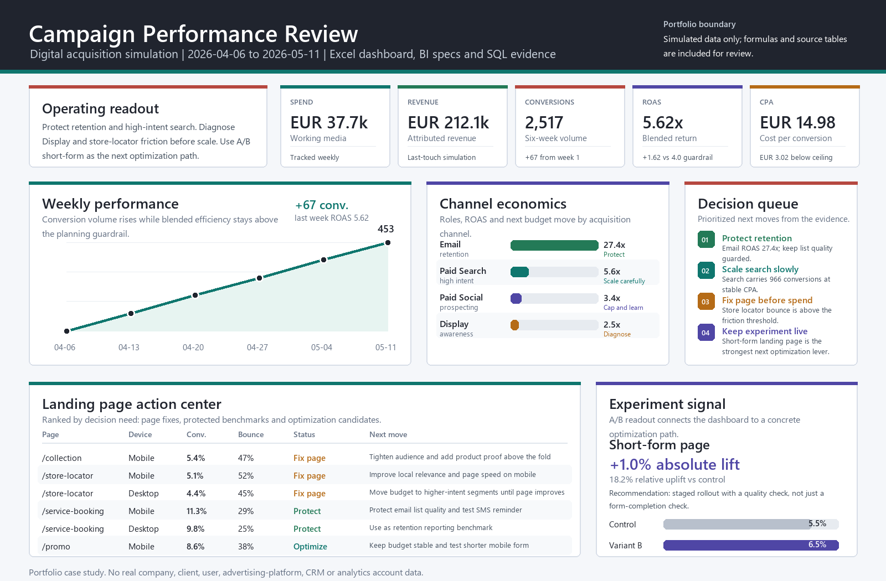

# Digital Campaign Performance Dashboard

Simulated digital campaign analytics case study for junior Web/Digital/Campaign Analyst roles.

## Dashboard preview



## What this project shows

- I can define and explain campaign KPIs.
- I can organize campaign data into readable reporting views.
- I can compare performance by channel, device, audience and landing page.
- I can run a small A/B testing analysis with uplift, confidence interval, p-value, Bayesian summary and rollout recommendation.
- I can document attribution logic, funnel/cohort SQL and CRM-style lifecycle metrics without overstating the data source.
- I can define a GA4 tracking plan with event names, parameters, key events, audiences, custom dimensions and a BigQuery-style export shape.
- I can document Consent Mode/GDPR measurement implications, UTM taxonomy governance and practical tracking QA cases.
- I can translate the same marketing model into Power BI, Tableau and Looker Studio-ready artifact specs.
- I can turn metrics into practical optimization recommendations.
- I can document assumptions, limitations and next steps.

## KPI covered

- Impressions
- Clicks
- CTR
- CPC
- Conversions
- Conversion rate
- CPA
- Revenue
- ROAS
- Landing page performance
- Weekly trend
- A/B testing conversion uplift
- Attribution logic
- Funnel, cohort and CRM lifecycle SQL evidence
- GA4 key event mapping
- Consent Mode/GDPR tracking controls
- UTM taxonomy compliance
- Looker Studio dashboard specification
- Tracking QA status

## Marketing analyst evidence

| Evidence | Where to look | What it demonstrates |
| --- | --- | --- |
| Campaign dashboard | `dashboard/campaign_dashboard.xlsx`, `assets/campaign_dashboard_preview.png` | CTR, CPC, conversion rate, CPA, ROAS, revenue, landing-page and weekly trend reporting |
| A/B testing | `reports/ab_test_marketing_uplift.md`, `src/analyze_ab_test.py` | Conversion uplift, 95% confidence interval, p-value, Bayesian probability and recommendation |
| GA4/tracking plan | `tracking/GA4_EVENT_PLAN.md`, `tracking/TRACKING_QA_CHECKLIST.md` | GA4 event model, key events, parameters, audiences, BigQuery-style export shape and QA cases |
| UTM and consent governance | `tracking/UTM_TAXONOMY.md`, `tracking/CONSENT_MODE_GDPR_NOTES.md` | Campaign URL taxonomy, source/medium controls, Consent Mode signals and GDPR-aware measurement boundaries |
| SQL evidence | `sql/SQL_EVIDENCE.md`, `sql/marketing_analytics_evidence.sql` | Joins, CTEs, window functions, funnel, CRM lifecycle, attribution and KPI aggregation |
| BI evidence | `bi/README.md`, `bi/powerbi/model.bim`, `bi/powerbi/report_spec.json`, `bi/tableau/campaign_performance_workbook.twb`, `bi/looker_studio/report_spec.md`, `tracking/looker_studio_dashboard_spec.md` | Power BI semantic model/report spec, Tableau workbook skeleton and Looker Studio dashboard specification for mainstream BI review |

## Recruiter 5-minute route

1. Open `reports/executive_summary.md`
2. Review `reports/ab_test_marketing_uplift.md`
3. Open `sql/SQL_EVIDENCE.md`
4. Read `tracking/GA4_EVENT_PLAN.md`, `tracking/UTM_TAXONOMY.md`, `tracking/CONSENT_MODE_GDPR_NOTES.md` and `tracking/TRACKING_QA_CHECKLIST.md`
5. Review `bi/README.md`, `bi/looker_studio/report_spec.md` and `tracking/looker_studio_dashboard_spec.md`
6. Check `dashboard/campaign_dashboard.xlsx`
7. Read `docs/kpi_dictionary.md` and `docs/assumptions_and_limits.md`

## Boundaries

This is a portfolio case study using simulated data only. It does not claim access to real company, client, user, advertising-platform, CRM, GA4 or analytics account data.

## Repository structure

| Path | Purpose |
| --- | --- |
| `data/campaign_performance_sample.csv` | Simulated campaign performance sample with KPI fields. |
| `data/landing_page_sample.csv` | Simulated landing page performance sample. |
| `data/ab_test_conversion_sample.csv` | Simulated landing-page A/B test sample. |
| `requirements.txt` | Pinned Python dependencies for workbook generation and tests. |
| `dashboard/campaign_dashboard.xlsx` | Excel dashboard workbook for quick review. |
| `sql/SQL_EVIDENCE.md` | Ten reviewer-friendly SQL queries using the committed sample CSVs. |
| `sql/marketing_analytics_evidence.sql` | Runnable DuckDB companion file for the SQL evidence. |
| `tracking/GA4_EVENT_PLAN.md` | GA4 event model, key events, parameters, audiences, custom dimensions and BigQuery-style export shape for a live implementation. |
| `tracking/UTM_TAXONOMY.md` | UTM naming convention, source/medium controls, valid/invalid examples and campaign registry fields. |
| `tracking/CONSENT_MODE_GDPR_NOTES.md` | Consent Mode signals, cookie categories and consent-aware measurement interpretation. |
| `tracking/TRACKING_QA_CHECKLIST.md` | Pre-launch web analytics QA cases for UTMs, redirects, forms, consent states and conversion duplication. |
| `tracking/looker_studio_dashboard_spec.md` | Looker Studio page, source, control and metric specification for a GA4-style campaign dashboard. |
| `reports/executive_summary.md` | Stakeholder-style summary and recommendations. |
| `reports/weekly_campaign_insights.md` | Weekly trend notes by campaign period. |
| `reports/ab_test_marketing_uplift.md` | A/B test readout with uplift, confidence interval, p-value, Bayesian summary and recommendation. |
| `bi/` | Power BI, Tableau and Looker Studio text artifacts for mainstream BI evidence. |
| `docs/kpi_dictionary.md` | KPI definitions, formulas and interpretation notes. |
| `docs/assumptions_and_limits.md` | Scope boundaries and simulated-data assumptions. |
| `docs/recruiter_5_min_route.md` | Fast route for recruiters and hiring managers. |
| `src/analyze_ab_test.py` | Rebuilds the A/B test JSON and markdown reports. |
| `src/build_summary.py` | Rebuilds the markdown reports from the CSV files. |
| `src/validate_data.py` | Validates schema, required values and KPI calculations. |
| `tests/test_tracking_docs.py` | Verifies that tracking evidence covers GA4, consent, UTM, QA and Looker Studio artifacts. |

## How to run

```bash
python -m venv .venv
python -m pip install -r requirements.txt
python src/validate_data.py
python src/analyze_ab_test.py
python src/build_summary.py
python src/build_dashboard.py
```

To run the SQL evidence after installing DuckDB:

```bash
duckdb < sql/marketing_analytics_evidence.sql
```
